# WDP3 – Exercise 4

CSS Layouts: From inline and block elements to complex page layouts in one exercise…

## 1 Website design - Let's make a plan

Before coding a website layout in CSS I usually start drawing some wireframes. I prefer using pen and paper for that.

Defining the page structure is also part of web development. Based on a design (done by yourself or by a web designer) you have to decide how to enhance the HTML code (with `div`s and classes) in order to implement the given design.

For our first website let's keep it clean and simple.

Following are three wireframes for the homepage, the portfolio, and the contact page.

> Feel free to draw and implement your own layouts! In this exercise we will build a website layout based on these wireframes.

### 1.1 Homepage design

On the homepage we define a maximum width for the text and center the content on the page. As a teaser for the portfolio sub-page we add a short list with our top 3 projects and a button below leading to the portfolio page.

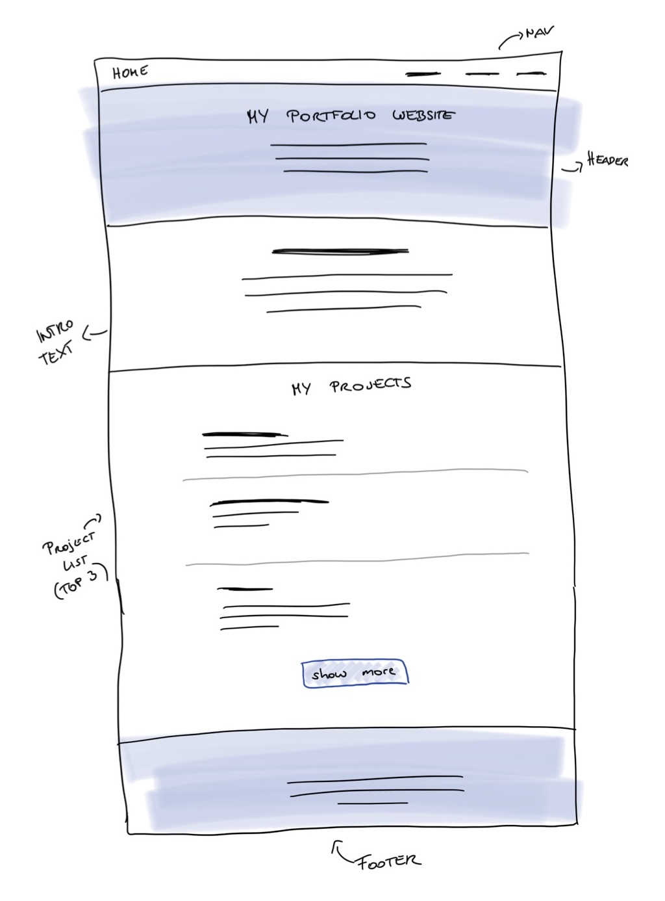

### 1.2 Portfolio design

The portfolio is a list of projects presented in a nice grid design.

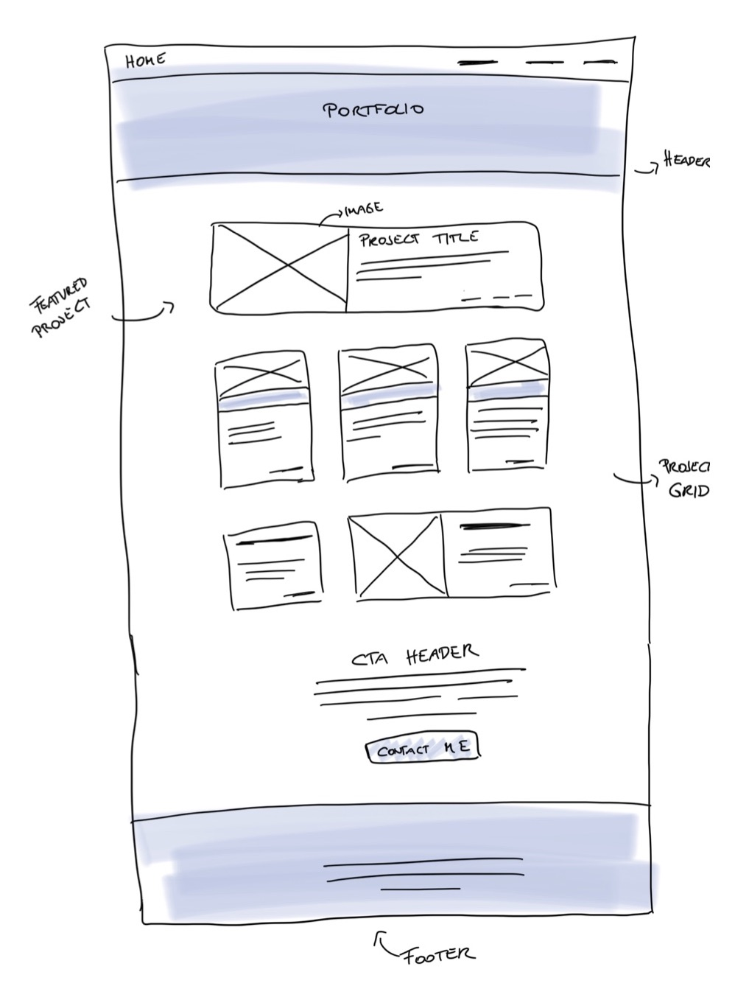

### 1.3 Contact page design

The contact page could look similar to the following wireframe.

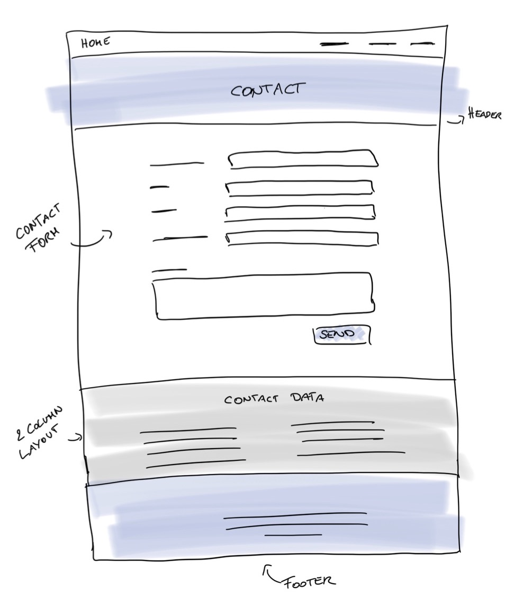

## 2 Responsive design & mobile first

Of course we want our website to look good on a wide variety of screen sizes. It's always a good idea to implement a website layout with a mobile first approach in mind. Here's a wireframe how the website should look on small screens.

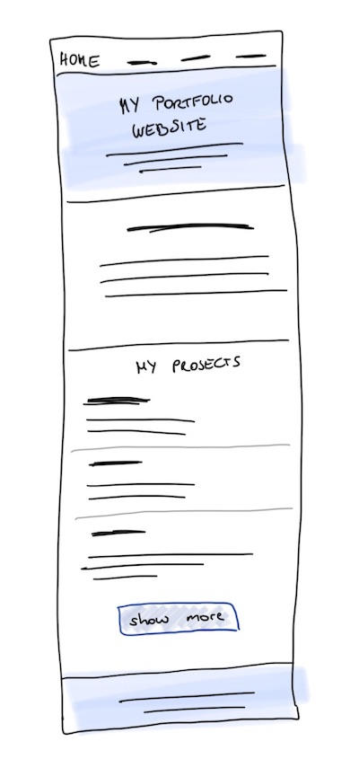

### 2.1 Viewport meta information

Back when responsive design and media queries didn't yet exist, browsers had to scale down websites to fit the whole content into smaller screens. This is still the default behavior and will prevent mobile layouts to be applied on small screens. To disable this behavior we have to add the following meta tag to our pages' head section:

```html
<meta name="viewport" content="width=device-width, initial-scale=1" />
```

It's like telling the browser that you know what you're doing and have styles for varying device sizes in place.

### 2.2 Test your design in Dev Tools

Developer tools are great for testing your responsive design. Open the index page of your portfolio website in the browser and then open the development tools. Activate the device toolbar by clicking the button next to the elements-tab or using a shortcut.

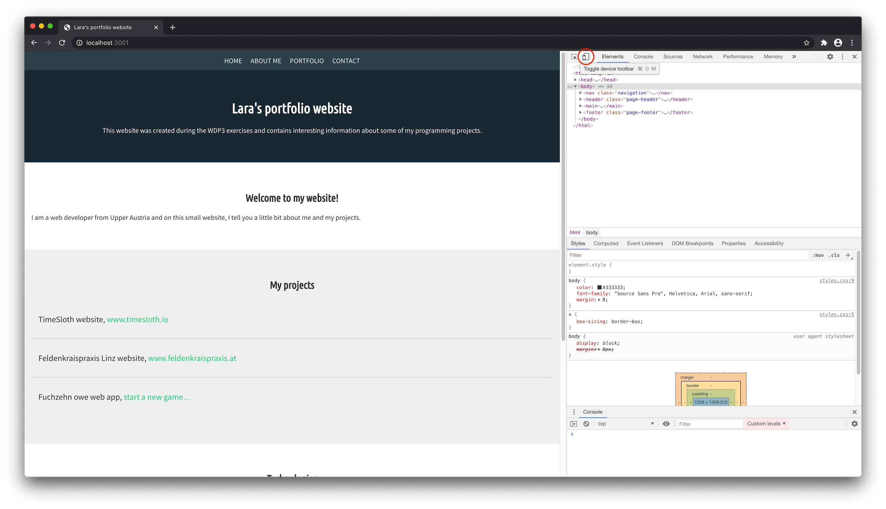

You can now resize the available viewport of your website manually or switch to predefined sizes of different (mobile) devices. Use this developer tools feature when creating responsive layouts!

## 3 Center the content

Currently all texts on our website start at the left edge of the viewport and, as paragraphs are block elements, use 100% of our page width. On larger screens this makes text hard to read. So we will define a maximum width for the content of the website sections, e.g. 800px, in our CSS file:

```css
.content-container {
  max-width: 800px;
}
```

> The perfect paragraph width depends on the font-size and the amount of characters that fit into one line of text.

In our HTML files we have to add a wrapping `div` element with the class `content-container` to all content sections like in the following code snippet:

```html
<section>
  <div class="content-container">
    <h2>Welcome to my website!</h2>
    <p>
      I am a web developer from Upper Austria and on this small website, I tell
      you a little bit about me and my projects.
    </p>
  </div>
</section>
```

> Note that we don't add the `content-container` class to the section but add an extra `div` element. This way the section is a full-width element and can for example have a background-color (like the header) and only the content within is limited in size.

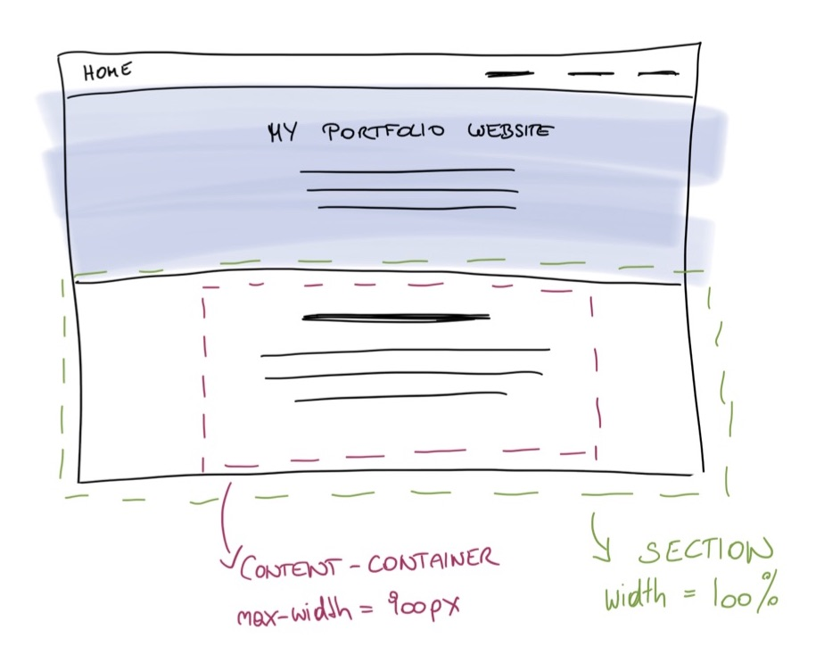

To center the content-containers within the section we have to add auto-margins on the left and the right:

```css
.content-container {
  max-width: 800px;
  margin-left: auto;
  margin-right: auto;
}
```

Use the browser's developer tools and resize the viewport to check if everything looks good on small and large screen sizes.

If not already done in the last exercise, add some padding to your sections to have some space between the browser window and the text on smaller screens.

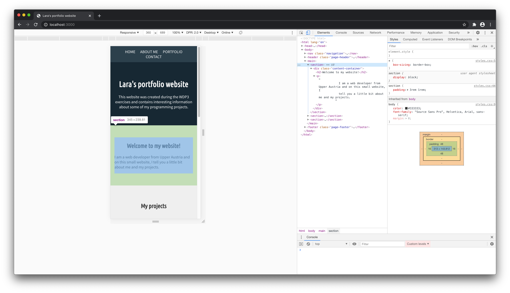

This is how the homepage should look like with the content centered.

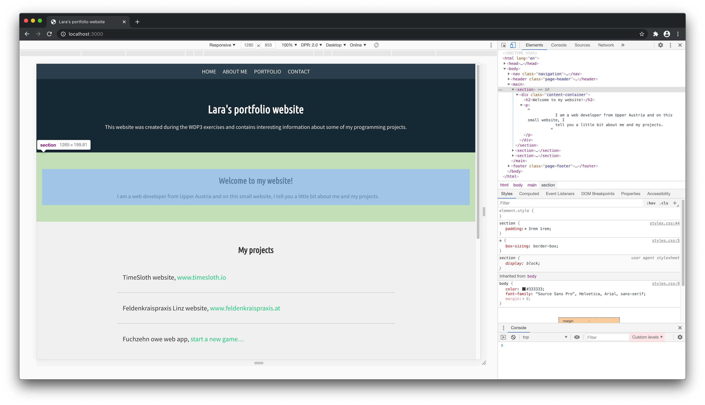

## 4 CSS Flexbox

There are some use cases where CSS flexbox can be used to lay out elements on our website.

### 4.1 Navigation layout with flexbox and media queries

We want the link to our homepage to be on the left side of our navbar and all the other nav elements to be right aligned. This can be done easily with flexbox and a few lines of CSS. Either try it yourself or find some help below…

.

.

.

.

.

.

.

.

.

.

.

.

.

```css
.navigation {
  display: flex;
  align-items: flex-end;
}

.nav-item:first-child {
  margin-right: auto;
}
```

On very small screens it could be that the navigation items don't have enough space in one row, so we only want to apply the flex layout once the screen is wide enough. In my case (with four nav items) the screen has to be at least 400px wide in order to place all items in one row. Sounds like we need our first media query here to wrap the CSS code we wrote before!

```css
@media screen and (min-width: 400px) {
  .navigation {
    display: flex;
    align-items: flex-end;
  }

  .nav-item:first-child {
    margin-right: auto;
  }
}
```

This means: only apply the given styles on media screen and a minimum width of 400px.

### 4.2 Sticky footer with flexbox

Sometimes you have pages with little content but you always want the footer to stick to the bottom of the browser window.

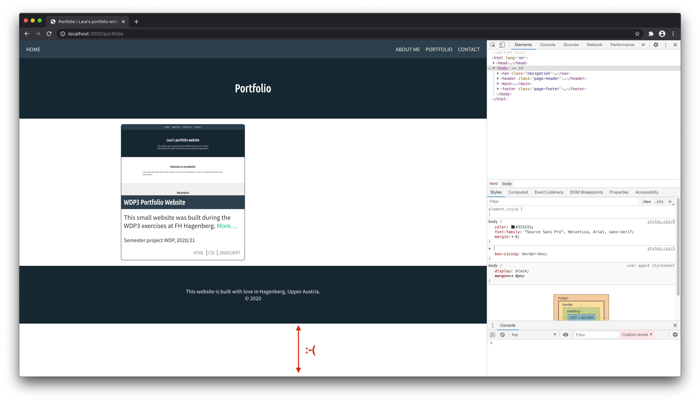

Let's think about what we want to achieve: all items on our page (navigation, header, main, footer) should be laid out from top to bottom in a column direction. Everything should fill 100% of the available height. The main section should always take all of the available space, all the other items should be as big as they need to be to contain all their content.

And now the same, but described in CSS:

```css
/* We have to set the min-height of the wrapping elements to 100% of the viewport height. */
html,
body {
  min-height: 100vh;
}

body {
  display: flex;
  flex-direction: column;
}

main {
  flex: 1; /* Short for flex-grow: 1 and flex-shrink: 0 */
}
```

> Note: This solution only works if the navigation, the header, the main section and the footer are all direct children of the body element and therefore become flex-items once `display: flex` is set on the body. If your HTML code looks different you need to find the element that's the parent of your content-section and the footer and make this one the flex-container.

And tada 🎉 – there is our sticky footer.


### 4.3 Technologies list with flexbox (instead of inline elements)

Last time we used `display: inline` to align the technology-list entries of a portfolio item next to each other. This is perfectly fine, but as we want to get familiar with using flex-layout for our designs, let's remove this line again from our CSS and see what CSS flexbox can do for us. Give it a try before looking at the solution below! (Hint: It's similar to the navigation!)

```css
.project-technologies li {
  /* Remove the following line again… */
  /* display: inline; */
}
```

.

.

.

.

.

.

.

.

.

.

.

.

.

```css
/* …and make the list (ul) itself a flex container! */
.project-technologies {
  display: flex;
  align-items: flex-end;
}
```

## 5 Portfolio layout with grid and media queries

Let's stay on the portfolio page and add some more projects. For now we will focus on the page layout, so we will copy and paste the one portfolio entry we already created and styled last time. Later, when there's some time left, we can replace the content anytime with other great projects we want to present on this page.

The markup should look similar to this:

```html
<div class="content-container project-grid">
  <div class="project">
    <!-- the code from last time -->
  </div>
  <div class="project">
    <!-- the code from last time -->
  </div>
  <div class="project">
    <!-- the code from last time -->
  </div>
  <div class="project">
    <!-- the code from last time -->
  </div>
  <div class="project">
    <!-- the code from last time -->
  </div>
  <div class="project">
    <!-- the code from last time -->
  </div>
  <!-- … -->
</div>
```

Last time I set a `width` property and some `margin` on the `.project` class which I will remove now because from now on I want the page to be fully responsive and the parent container (`.project-grid`) to take care about the page layout.

Currently my portfolio looks like this:

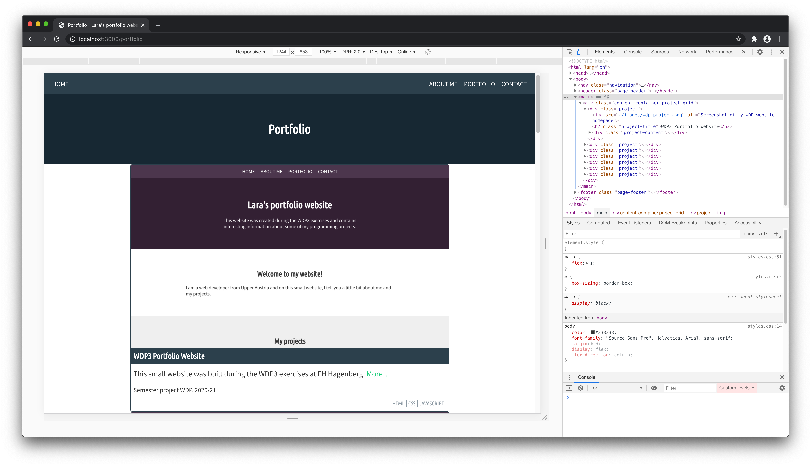

> Yep, maybe it's not the best idea to use the portfolio website itself as portfolio entry, but hey, I think you get the idea… 😉 (I changed the color of the screenshot a bit to see the difference.)

### 5.1 Mobile layout

On small screens, I want to display the entries below each other. This is what the normal document flow can do for us, no flexbox or grid layout needed. But we will add some paddings and margins so that there's some space between the single portfolio entries.

```css
.project-grid {
  padding: 2rem 1rem;
}

.project {
  margin-bottom: 2rem;
}
```

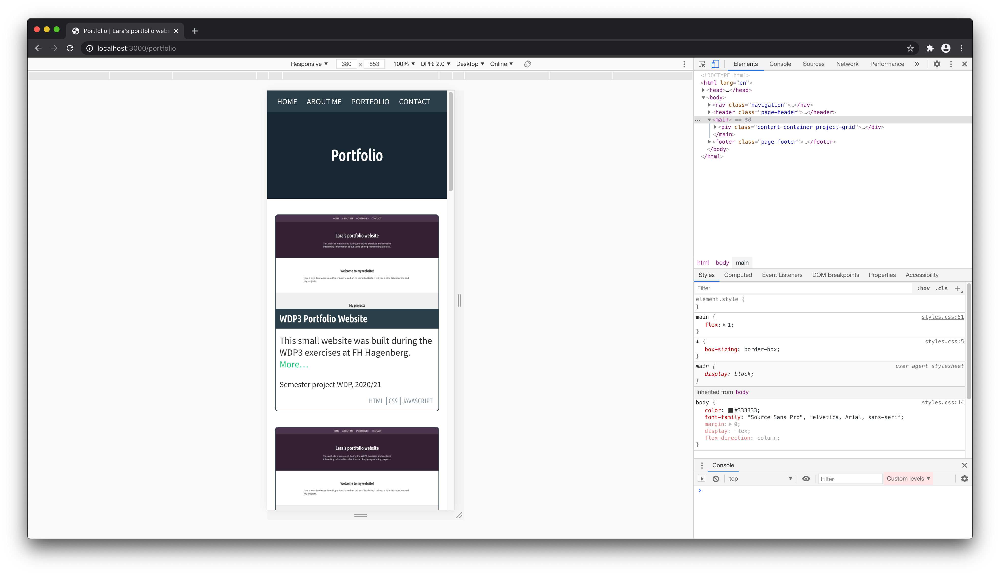

### 5.2 Two column layout

When there's enough space, the single-column layout should become a two-column layout using CSS grid and media queries. Try resizing your page in the browser to find a good value for a breakpoint we can use in our media query. I'll go with 640px.

```css
@media screen and (min-width: 640px) {
  .project-grid {
    display: grid;
    grid-template-columns: 1fr 1fr;
  }
}
```

As now the `grid-gap` property defines the space between the single portfolio entries, I can remove the project's margin bottom I needed for the one-column layout.

```css
@media screen and (min-width: 640px) {
  .project-grid {
    display: grid;
    grid-template-columns: 1fr 1fr;
    gap: 2rem;
  }

  .project {
    margin-bottom: 0;
  }
}
```

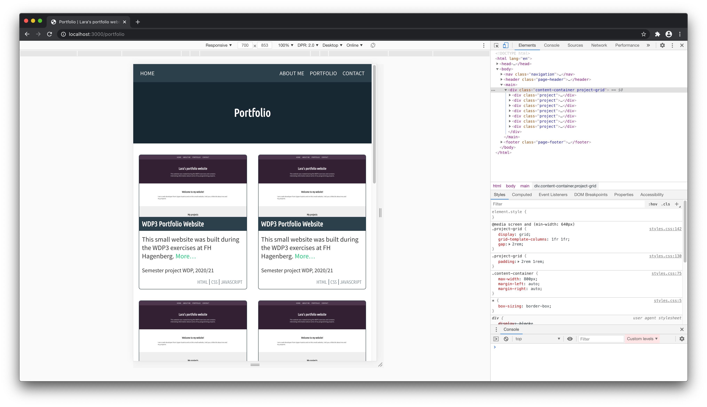

### 5.3 Full width layout

On large screens I want my portfolio grid to have three columns. Let's add another breakpoint and override the `grid-template-columns` property.

```css
@media screen and (min-width: 1100px) {
  .project-grid {
    grid-template-columns: repeat(3, 1fr);
  }
}
```

> Note: You don't have to repeat the other properties like `display: grid` or `gap: 2rem` unless you want to change the values.

Since the grid is not pure text content, I also want to increase the width of the whole portfolio content container. I override the `max-width` of 800px I set on the `.content-container` earlier, but only for the project grid.

```css
@media screen and (min-width: 1100px) {
  .project-grid {
    grid-template-columns: repeat(3, 1fr);
    max-width: 1000px;
  }
}
```

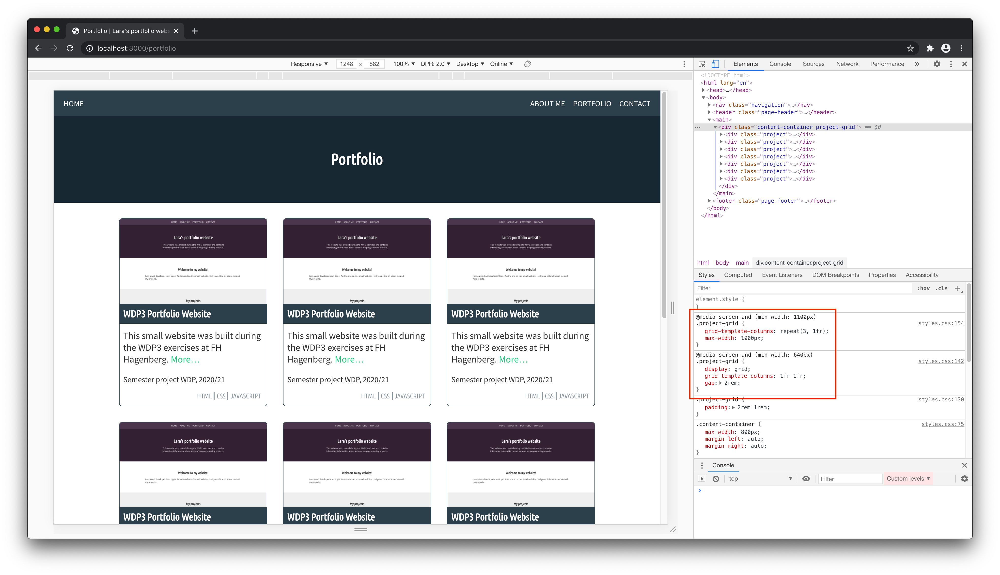

> On the screenshot above you can see that the `display` and the `gap` property from the CSS rule in the 640px media query are still in use and only the `grid-template-columns` property is replaced by the "new" CSS rule.

## 6 Combining flex and grid: featured portfolio entry

Flex and grid layouts can be combined. You can use flex layouts within grids and the other way round. In our portfolio layout we want to have entries that are bigger than the standard size (see the wireframe from 1.2). We will call them "featured projects".

A featured project spans two or three columns of the grid and the image is not above the text but on its left.

### 6.1 Adjust the size of the grid item

We can define the width of the grid item itself by overriding the default value for `grid-column-end` of the item. (By default a grid item ends at the next grid line.) For this we need a separate class (`.project-featured`) for the featured project(s) element.

```html
<div class="project project-featured">
  <!-- Portfolio entry -->
</div>
```

```css
@media screen and (min-width: 640px) {
  .project-featured {
    /* The item spans 2 columns */
    grid-column-end: span 2;
  }
}
@media screen and (min-width: 1100px) {
  .project-featured {
    /* The item spans 3 columns */
    grid-column-end: span 3;
  }
}
```

### 6.2 Adjust the grid item layout

Featured projects should have the image on the left side of the text. The image should take 40% of the full width. This means we have to adjust the HTML code a bit and add an additional `div` container around the project's text content.

```html
<div class="project project-featured">
  
  <!-- This div is new! -->
  <div>
    <h2 class="project-title">WDP3 Portfolio Website</h2>
    <div class="project-content">
      <p class="project-description">
        This small website was built during the WDP3 exercises at FH Hagenberg.
        <a href="./portfolio/wdp3-project.html">More…</a>
      </p>
      <p class="project-metadata">Semester project WDP, 2020/21</p>
      <ul class="project-technologies">
        <li>HTML</li>
        <li>CSS</li>
        <li>JavaScript</li>
      </ul>
    </div>
  </div>
</div>
```

By changing the `display` property of the `project-featured` element to `flex`, the image and the new `div` we just added become flex items. When we limit the size of the image our implementation looks very similar to the wireframe.

```css
@media screen and (min-width: 640px) {
  .project-featured {
    grid-column-end: span 2;
    display: flex;
  }

  .project-featured img {
    max-width: 40%;
  }
}
```

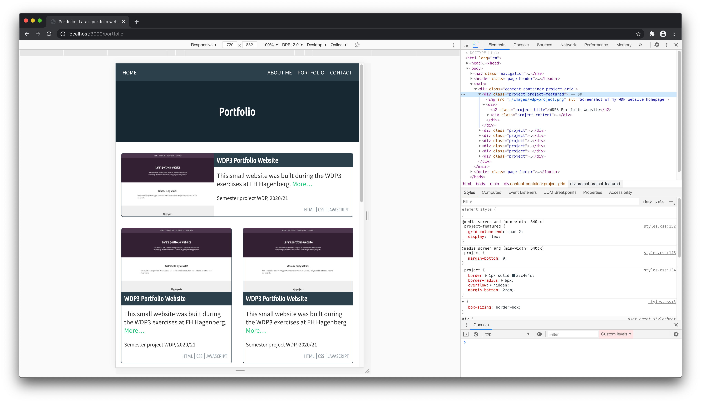

There's one problem left: by default the `align-items` property of the flex container is set to `stretch` which means the image, which is a flex-item, always fills the available height and width and the aspect ratio is not preserved. There are many solutions to this problem, depending on the desired outcome. I'll go with the following code adjustments:

```css
@media screen and (min-width: 640px) {
  .project-featured {
    grid-column-end: span 2;
    display: flex;

    align-items: flex-start;
    padding: 1rem;
    border-width: 2px;
  }

  .project-featured img {
    max-width: 40%;

    margin-right: 1rem;
  }

  .project-featured .project-title {
    color: #2c404c;
    background-color: #ffffff;
  }
}
```

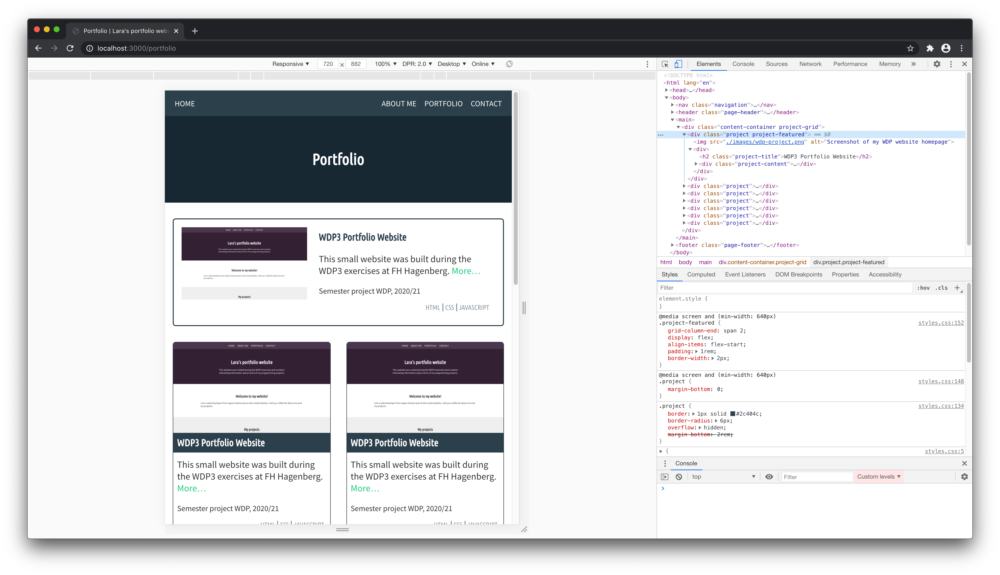

## 7 More CSS

There is so much more we can do on our small portfolio page:

- Use CSS grid and/or CSS flexbox to build a layout for the contact page
- Use CSS grid to build a layout for the technologies table we added in the first exercise
- Use CSS custom properties for the colors used on your website
- Add a dark/light mode by using a combination of media queries (`@media screen and (prefers-color-scheme: dark)`) and CSS custom properties
- Add animations and transitions
- Use a `srcset` attribute for your images to always load the correct image sizes
- Add semantics (JSON-LD, Open Graph data)
- …

## Further reading

Using CSS flex or grid layout you can build almost any page layout from very simple to complex. Which one's the best choice always depends on your use case.

If you want to dig deeper you can read through [the complete CSS flexbox guide](https://css-tricks.com/snippets/css/a-guide-to-flexbox/) and [the complete CSS grid guide](https://css-tricks.com/snippets/css/complete-guide-grid/) on CSS Tricks. There you can find all available properties and nice illustrations that help understanding what's going on.

Wanna play a game? Try [Flexbox Froggy](https://flexboxfroggy.com) or [Grid Garden](http://cssgridgarden.com).
