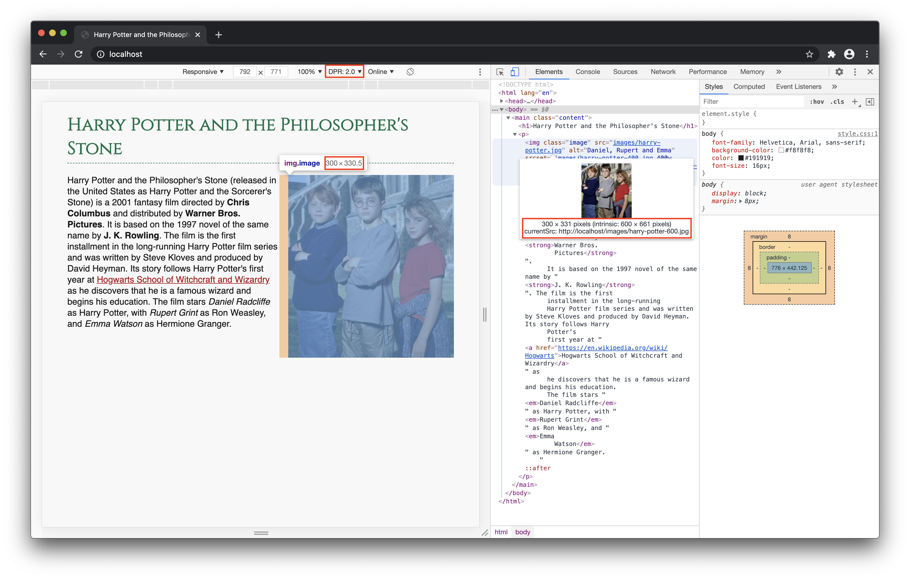

# WDP3 – More

There are many HTML and CSS features we didn't check out in the exercises. Here are some additional examples, hopefully answering questions that came up during the last weeks.

## CSS custom properties

CSS custom properties (also called CSS variables) are a powerful CSS feature! Here are some links to interesting articles about this topic (some already more advanced):

* [CSS custom properties on MDN](https://developer.mozilla.org/en-US/docs/Web/CSS/--*)
* [A Strategy Guide](https://www.smashingmagazine.com/2018/05/css-custom-properties-strategy-guide/)
* [Difference between CSS variables and preprocessor variables](https://css-tricks.com/difference-between-types-of-css-variables/)
* [CSS Custom Properties in the Cascade](https://www.smashingmagazine.com/2019/07/css-custom-properties-cascade/)
* [Houdini custom properties](https://web.dev/at-property/)

In the [`css-custom-properties` folder](./css-custom-properties) you can find a small theming example. Open the `index.html` file and resize your browser window. See how the colors change based on the viewport width…

The background-color values for the navigation, the header and the footer are set only once:

```css
.page-header,
.page-footer {
  background-color: var(--color-primary);
}

.navigation {
  background-color: var(--color-primary-light);
}
```

The CSS custom property values are changed based on the viewport with via media queries:

```css
body {
  --color-primary: #404040;
  --color-primary-light: #676767;
}

@media screen and (min-width: 500px) {
  body {
    --color-primary: #6c1938;
    --color-primary-light: #953659;
  }
}

@media screen and (min-width: 800px) {
  body {
    --color-primary: #1e550a;
    --color-primary-light: #357120;
  }
}

@media screen and (min-width: 1000px) {
  body {
    --color-primary: #172833;
    --color-primary-light: #2c404c;
  }
}
```

Without CSS custom properties you would have to write something like this:

```css
.page-header,
.page-footer {
  background-color: #404040;
}

.navigation {
  background-color: #676767;
}

@media screen and (min-width: 500px) {
  .page-header,
  .page-footer {
    background-color: #6c1938;
  }

  .navigation {
    background-color: #953659;
  }
}

/* and so on… */
```

## Responsive images: srcset attribute and the picture element

When you include an image on your webpage you use the `img` element with a `src` and an `alt` attribute like this:

```html

```

Let's assume the `harry-potter.jpg` image has a width of 900px, but the place on your webpage where the image is displayed is only 300px wide – then you have an image which is too big and you load more data than you actually need. To solve this problem you can provide more versions of the image and let the browser know how much space the image needs on your webpage like this:

```html

```

Use the `srcset` attribute to define the different image sources. Use the `sizes` attribute to define how the image is displayed; the code here should be based on your styles. In the CSS file, you can find the following:

```css
.image {
  max-width: 100%;
}

@media screen and (min-width: 550px) {
  .image {
    max-width: 300px;
  }
}
```

See how this is related to the `sizes` value?

Based on the additional information the browser now chooses the perfect image. Find an example in the [`srcset` folder](./srcset) you can open in your browser. Open the developer tools and check which image is actually loaded. Note that this also depends on the `DPR` (device pixel ratio) value: if this is set to 2, the image loaded on a min-screen-width of 550px is the one which is 600px wide (not the 400px wide image). So the browser also takes into account the device screen's pixel density (and we don't have to do the calculations ourselves).



> Note: Once a larger image has already been loaded, the browser never loads a smaller version of the same image again when resizing the browser window.

This is where using the `srcset` attribute and using the `<picture>` element have their differences. Using the `picture` element you as developer decide what the browser should do, the browser doesn't choose anymore.

```html
<picture>
  <source media="(max-width: 600px)" srcset="appletree-square.jpg">
  <source media="(min-width: 601px)" srcset="appletree.jpg">
  
</picture>
```

In the example above you provide two versions of the appletree image, the original one and a square version of it. Up to a screen size of 600px your design requires the image to be squared, so you define this via the `media` attribute. The `img` element serves as fallback and provides an alternative text.

When it comes to newer image formats in the web, like `webp` and `avif`, you can use the `picture` element to provide fallbacks for browsers that do not (yet) support these but still make use of better compressed images in browsers that already support these new image file types.

Find more about the picture element on [MDN](https://developer.mozilla.org/en-US/docs/Web/HTML/Element/picture).

## Positioning

In the lecture we learned that there's the `position` property in CSS with the following values available: static, relative, absolute, fixed, and sticky. By using `position` and `top`, `bottom`, `left`, and `right` in your CSS you can place every element wherever you want it to be if you need to remove it from the normal document flow (where every element is static by default).

Here are two articles that explain the differences and include some examples:

* [Absolute, Relative, Fixed Positioning: How Do They Differ?](https://css-tricks.com/absolute-relative-fixed-positioining-how-do-they-differ/)
* [Absolute Positioning Inside Relative Positioning](https://css-tricks.com/absolute-positioning-inside-relative-positioning/)